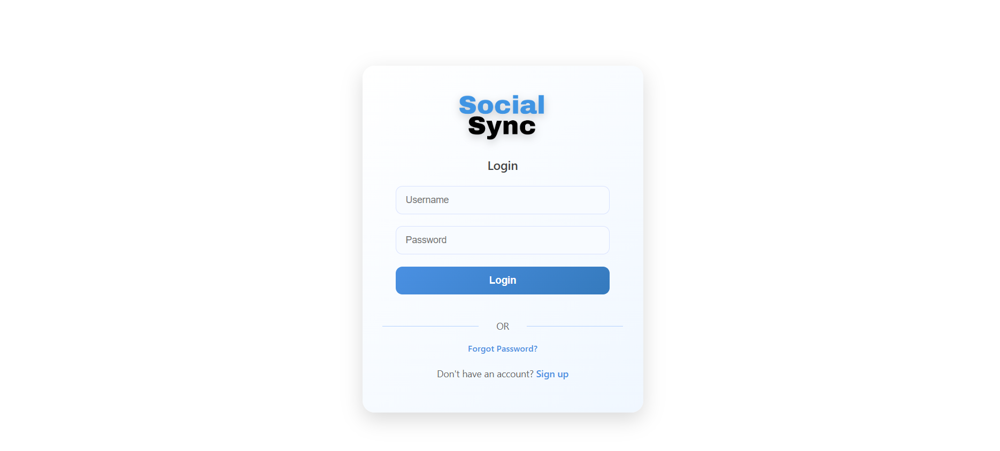

# Instagram Clone Frontend

This is a front-end-only clone of Instagram, built using React. It simulates basic Instagram features like login, profile view, stories, and posts.

## 🔐 Login Credentials

- **Username:** `user`
- **Password:** `12345678`

> These are default credentials set for demo purposes only.

## 🚀 Features

- Login page with default credentials
- Home page with posts and stories
- Profile section (static)
- Fully responsive UI

## 🛠️ Tech Stack

- React
- CSS 
- JSX

## 📦 Installation

1. Clone the repository:
   ```bash
   git clone https://github.com/yadav09anil/instagram-clone-frontend.git
   ```

 ## 📸 Screenshots

Below are some screenshots of Instagram Clone website:

###  Loginn Page


###  Home


###  Profile Page 

